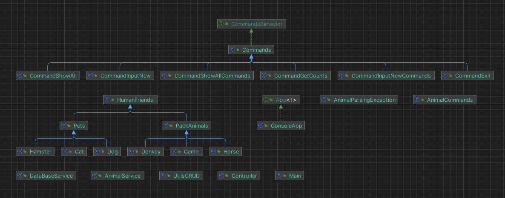

### Операционные системы и виртуализация (Linux)

#### 1. Использование команды cat в Linux
   - Создать два текстовых файла: "Pets"(Домашние животные) и "Pack animals"(вьючные животные), используя команду `cat` в терминале Linux. В первом файле перечислить собак, кошек и хомяков. Во втором — лошадей, верблюдов и ослов.
   - Объединить содержимое этих двух файлов в один и просмотреть его содержимое.
   - Переименовать получившийся файл в "Human Friends"(.
Пример конечного вывода после команды “ls” :
Desktop Documents Downloads  HumanFriends.txt  Music  PackAnimals.txt  Pets.txt  Pictures  Videos


#### 2. Работа с директориями в Linux
   - Создать новую директорию и переместить туда файл "Human Friends".


3. Работа с MySQL в Linux. “Установить MySQL на вашу вычислительную машину ”
   - Подключить дополнительный репозиторий MySQL и установить один из пакетов из этого репозитория.


4. Управление deb-пакетами
   - Установить и затем удалить deb-пакет, используя команду `dpkg`.


Работы с MySQL и ООП я объединил в единую программу.




Файл для инициалиазации базы

[init.sql](src%2Fmain%2Fresources%2Finit.sql)

Запускается по данным из Properties

```java
package org.gr40in.database;

import java.io.IOException;
import java.io.InputStream;
import java.nio.file.Files;
import java.nio.file.Path;
import java.sql.*;
import java.util.List;
import java.util.Properties;

public class DataBaseService {

    public static Connection getConnection() {
        Path DBpath = Path.of("src/main/resources/database.properties");
        Connection resultConnection = null;
        Properties dbProperties = new Properties();

        try (InputStream is = Files.newInputStream(DBpath)) {
            dbProperties.load(is);
        } catch (IOException e) {
            System.out.println("Properties read ERROR: " + e.getMessage());
        }

        try {
            resultConnection = DriverManager.getConnection(
                    dbProperties.getProperty("DB_URL"),
                    dbProperties.getProperty("DB_USER"),
                    dbProperties.getProperty("DB_PASSWORD"));
        } catch (SQLException e) {
            System.out.println("Connection ERROR: " + e.getMessage());
        }
        return resultConnection;
    }

    public static void initDataBase() {
        Path sqlInitFile = Path.of("src/main/resources/init.sql");
        List<String> tempList = null;
        String query = "";
        try {
            tempList = Files.readAllLines(sqlInitFile);
            for (String line : tempList) {
                query = query + line;
            }
        } catch (IOException e) {
            throw new RuntimeException(e);
        }

        Connection connection = DataBaseService.getConnection();
        try {
            PreparedStatement preparedStatement = connection.prepareStatement(query);
            ResultSet resultSet = preparedStatement.executeQuery();
            while (resultSet.next()) {
                System.out.println(resultSet.getString("Database"));
            }
        } catch (SQLException e) {
            throw new RuntimeException(e);
        }
    }
}
```


Часть работы с базой 
```java
package org.gr40in.database;

import org.gr40in.model.*;

import java.sql.*;
import java.time.LocalDate;
import java.util.ArrayList;
import java.util.List;
import java.util.Locale;

public class UtilsCRUD {
    public static List<HumanFriends> getAllFriends() {
        List<HumanFriends> allHumanFriends = new ArrayList<>();

        String query = "SELECT * FROM human_friends_db.human_friends";

        try (Connection connection = DataBaseService.getConnection()) {
            PreparedStatement prepareStatement = connection.prepareStatement(query);
            ResultSet resultSet = prepareStatement.executeQuery();
            while (resultSet.next()) {
                HumanFriends tempLink = null;
                Long animalTypeID = resultSet.getLong("animal_type");
                String type = UtilsCRUD.getTypeName(animalTypeID);
                switch (type) {
                    case "Dog" -> tempLink = new Dog();
                    case "Cat" -> tempLink = new Cat();
                    case "Hamster" -> tempLink = new Hamster();
                    case "Horse" -> tempLink = new Horse();
                    case "Camel" -> tempLink = new Camel();
                    case "Donkey" -> tempLink = new Donkey();
                }

                Long id = resultSet.getLong("id");
                Date tempDate = resultSet.getDate("birth_DATE");
                LocalDate tempLocalDate = new java.sql.Date(tempDate.getTime()).toLocalDate();
                List<AnimalCommands> commandsList = UtilsCRUD.getAllCommands(id);

                tempLink.setHumanFriendsId(id);
                tempLink.setName(resultSet.getString("name"));
                tempLink.setBirthDay(tempLocalDate);
                tempLink.setCommands(commandsList);

                allHumanFriends.add(tempLink);
            }
            return allHumanFriends;

        } catch (SQLException e) {
            throw new RuntimeException(e);
        }
    }

    public static List<AnimalCommands> getAllCommands(Long animalId) {

        List<AnimalCommands> animalCommandsList = new ArrayList<>();
        String query = "SELECT * FROM human_friends_db.commands WHERE id = ? ORDER BY command_name";

        try (Connection connection = DataBaseService.getConnection()) {
            PreparedStatement prepareStatement = connection.prepareStatement(query);
            prepareStatement.setLong(1, animalId);
            ResultSet resultSet = prepareStatement.executeQuery();
            while (resultSet.next()) {
                animalCommandsList.add(new AnimalCommands(
                        resultSet.getLong("id"),
                        resultSet.getString("command_name")
                ));
            }
            return animalCommandsList;
        } catch (SQLException e) {
            throw new RuntimeException(e);
        }
    }


    public static void createAnimal(HumanFriends oneHumanFriends) {
        UtilsCRUD.create_animal_types(oneHumanFriends);

        String query = "INSERT IGNORE INTO human_friends_db.human_friends (name, birth_DATE, animal_type) VALUES (?,?,?)";

        try (Connection connection = DataBaseService.getConnection()) {
            PreparedStatement prepareStatement = connection.prepareStatement(query);
            prepareStatement.setString(1, oneHumanFriends.getName());
            prepareStatement.setDate(2, Date.valueOf(oneHumanFriends.getBirthDay()));
            prepareStatement.setLong(3, UtilsCRUD.getTypeId(oneHumanFriends));
            prepareStatement.executeUpdate();
        } catch (SQLException e) {
            throw new RuntimeException(e);
        }
    }

    public static void create_animal_types(HumanFriends oneHumanFriends) {
        List<String> treeList = new ArrayList<>();
        Class startClass = oneHumanFriends.getClass();
        while (!startClass.getSimpleName().equals("Object")) {
            treeList.addFirst(startClass.getSimpleName());
            startClass = startClass.getSuperclass();
        }
        createAnimalType(treeList);
    }


    public static void createAnimalType(List<String> treeList) {
        System.out.println(treeList);
        for (int i = 1; i < treeList.size(); i++) {
            createBranchOfAnimalTree(treeList.get(i), treeList.get(i - 1));
        }
    }

    public static void createBranchOfAnimalTree(String animalName, String animalParent) {

        Long parentId = getParentId(animalParent);

        String query = "INSERT IGNORE INTO human_friends_db.type_of_animal (type_name, parent) VALUES (?,?)";

        try (Connection connection = DataBaseService.getConnection()) {
            PreparedStatement prepareStatement = connection.prepareStatement(query);
            prepareStatement.setString(1, animalName);
            prepareStatement.setLong(2, parentId);
            prepareStatement.executeUpdate();
        } catch (SQLException e) {
            throw new RuntimeException(e);
        }
    }


    public static boolean type_exist(String classOfAnimalType) {
        String query = "SELECT id FROM human_friends_db.type_of_animal where type_name=?";
        try (Connection connection = DataBaseService.getConnection()) {
            PreparedStatement preparedStatement = connection.prepareStatement(query);
            preparedStatement.setString(1, classOfAnimalType);
            ResultSet resultSet = preparedStatement.executeQuery();
            return resultSet.next();
        } catch (SQLException e) {
            throw new RuntimeException(e);
        }
    }

    public static Long getParentId(String animalTypeParentId) {
        String query = "SELECT id FROM human_friends_db.type_of_animal where type_name=?";
        Long result = 0L;
        try (Connection connection = DataBaseService.getConnection()) {
            PreparedStatement preparedStatement = connection.prepareStatement(query);
            preparedStatement.setString(1, animalTypeParentId);
            ResultSet resultSet = preparedStatement.executeQuery();
            if (resultSet.next()) result = resultSet.getLong("id");
        } catch (SQLException e) {
            throw new RuntimeException(e);
        }
        return result;
    }

    public static Long getTypeId(HumanFriends animal) {
        String query = "SELECT id FROM human_friends_db.type_of_animal where type_name=?";
        Long result = 0L;
        try (Connection connection = DataBaseService.getConnection()) {
            PreparedStatement preparedStatement = connection.prepareStatement(query);
            preparedStatement.setString(1, animal.getClass().getSimpleName());
            ResultSet resultSet = preparedStatement.executeQuery();
            if (resultSet.next()) result = resultSet.getLong("id");
        } catch (SQLException e) {
            throw new RuntimeException(e);
        }
        return result;
    }

    public static String getTypeName(Long animalTypeID) {
        String query = "SELECT type_name FROM human_friends_db.type_of_animal where id=?";
        String result = "";
        try (Connection connection = DataBaseService.getConnection()) {
            PreparedStatement preparedStatement = connection.prepareStatement(query);
            preparedStatement.setLong(1, animalTypeID);
            ResultSet resultSet = preparedStatement.executeQuery();
            if (resultSet.next()) result = resultSet.getString("type_name");
        } catch (SQLException e) {
            throw new RuntimeException(e);
        }
        return result;
    }

    public static void createNewCommand(String commandName, HumanFriends humanFriends) {
        if (!commandExist(commandName)) commandCreate(commandName);
        String query = "INSERT INTO one_animal_commands (animal_id, command_id) VALUES (?,?)";
        try (Connection connection = DataBaseService.getConnection()) {
            PreparedStatement preparedStatement = connection.prepareStatement(query);
            preparedStatement.setLong(1, humanFriends.getHumanFriendsId());
            preparedStatement.setLong(2, commandId(commandName));
            preparedStatement.executeUpdate();
        } catch (SQLException e) {
            throw new RuntimeException(e);
        }
    }

    public static boolean commandExist(String commandName) {

        String query = "SELECT id FROM human_friends_db.commands where command_name=?";
        try (Connection connection = DataBaseService.getConnection()) {
            PreparedStatement preparedStatement = connection.prepareStatement(query);
            preparedStatement.setString(1, commandName);
            ResultSet resultSet = preparedStatement.executeQuery();
            return (resultSet.next());
        } catch (SQLException e) {
            throw new RuntimeException(e);
        }
    }

    public static void commandCreate(String commandName) {

        String query = "INSERT IGNORE INTO human_friends_db.commands (command_name) VALUES (?)";
        try (Connection connection = DataBaseService.getConnection()) {
            PreparedStatement preparedStatement = connection.prepareStatement(query);
            preparedStatement.setString(1, commandName);
            preparedStatement.executeUpdate();
        } catch (SQLException e) {
            throw new RuntimeException(e);
        }
    }

    public static Long commandId(String commandName) {
        String query = "SELECT id FROM human_friends_db.commands where command_name=?";
        Long result = -100L;
        try (Connection connection = DataBaseService.getConnection()) {
            PreparedStatement preparedStatement = connection.prepareStatement(query);
            preparedStatement.setString(1, commandName);
            ResultSet resultSet = preparedStatement.executeQuery();
            while (resultSet.next()) result = resultSet.getLong("id");
        } catch (SQLException e) {
            throw new RuntimeException(e);
        }
        return result;
    }


    public static int getAnimalCount() {
        String query = "SELECT COUNT(*) as count FROM human_friends_db.human_friends";
        int result = 0;
        try (Connection connection = DataBaseService.getConnection()) {
            PreparedStatement preparedStatement = connection.prepareStatement(query);
            ResultSet resultSet = preparedStatement.executeQuery();
            while (resultSet.next()) result = resultSet.getInt("count");
        } catch (SQLException e) {
            throw new RuntimeException(e);
        }
        return result;
    }
}
```
